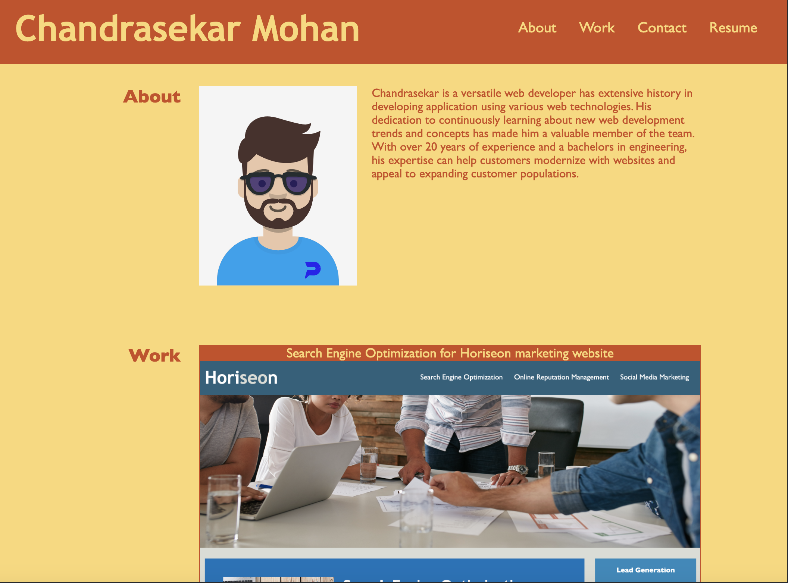

# 02-Advanced-CSS-Profile-Website

## Description

Profile website which uses HTML and Advanced CSS techniques such as flex display, navigation, media query etc to make the website more interactive, responsive & dynamically display profile content. 

Website has four links which can navigate to different sections of the page and open PDF resume file. 
- About
- Work
- Contact
- Resume

## Usage

Website has been deployed using GitHub pages and can be reached through below link,
https://chandraucb.github.io/02-Advanced-CSS-Profile-Website/

## Tests

Tested application responsiveness of layout changes with different screen size using Chrome debugger.